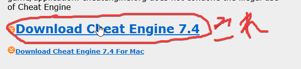
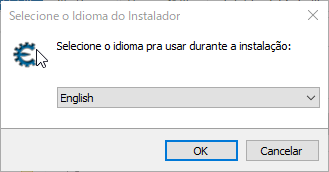
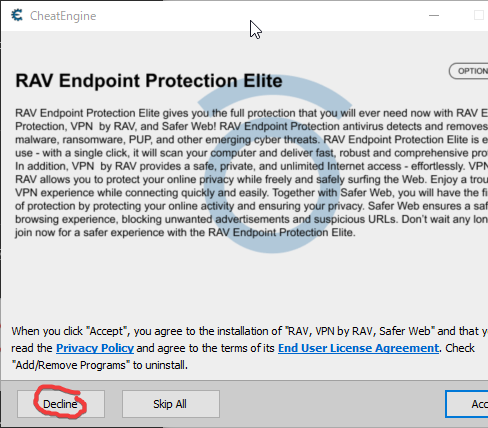

# sbx-tool

Dll hack for Twinkle ☆ Crusaders -Starlit Brave Xtream!!-  (version [1.19](https://lillian.jp/support/support.html))  
[vndb](https://vndb.org/v5937)  
[official](https://lillian.jp/kurukuru2/sbx.html)

Still work in progress.
Written in [Rust](https://www.rust-lang.org/) language.

# Special Thanks  
Thank you for the high quality libraries.  
[imgui](https://github.com/ocornut/imgui) by [ocornut](https://github.com/ocornut) and its [Rust binding](https://github.com/imgui-rs/imgui-rs)  
[ilhook-rs](https://github.com/regomne/ilhook-rs) by [regomne](https://github.com/regomne)  
[imgui-impl-win32-rs](https://github.com/super-continent/imgui-impl-win32-rs) by [super-continent](https://github.com/super-continent)  

# Download
[Debug dll](https://github.com/d42ejh/sbx-tool/raw/main/dlls/sbx_tool_dll_debug.dll)  
[Release dll](https://github.com/d42ejh/sbx-tool/raw/main/dlls/sbx_tool_dll_release.dll)  
  
Debug dll comes with a debug console.  
Release dll comes with no debug console and better runtime performance and small binary size.

# 使い方
自力でインジェクトできる方はお好きな方法でお願いします。

[CheatEngine](https://www.cheatengine.org/downloads.php)
からチートエンジンをダウンロードします。

ダウンロードした　CheatEnginexx.exe
を実行(ダブルクリック)してインストールします。

言語選択を迫られるので　English　を選択しましょう。

Okを押して進んでいくと不要なソフトのインストールを何度か訊ねられるので Decline で拒否しましょう。

ウィンドウズディフェンダーが誤検知で勝手にファイルを削除してしまうみたいなので例外に追加して消えないようにしてください。

無事インストールできたらチートエンジンを起動します。
SBXも起動します。

タイプするのが面倒になったので後は動画を貼っておきます。(すみません)
[動画](https://www.youtube.com/watch?v=PFOeAA7IwfA)

### Debug Console
  

# How To Build(WIP)
## 1
Install rust tool chains.
https://rustup.rs/

## 2 
Install rust nightly

## 3
todo  
  
  
  
# Change Log
#### 2022/6/28
Smooth graphic upon ex changes with the tool.

#### 2022/6/27
Smooth graphic upon hp changes with the tool.  

#### 2022/6/26
Partially disabled max ex cap.(Unstable. Cause crash sometimes. Probably when ex exceeds 2xxx ~ ?)  

#### 2022/6/25
Partially disabled max hp cap.(Unstable. Cause crash sometimes.)  

#### 2022/6/25
Refactored little.  

#### 2022/6/25
Refactored little.  

#### 2022/6/16
Using a better way to get address of directx functions now.  

#### 2022/05/29
Implemented ui loop switch case log.  (Sounds waste of time, but it eases further reversing!!)  

#### 2022/05/28
  
Implemented freeze check box for battle hp and ex.  

# TODOs  
- [ ] disable max hp cap.(Partially done.)
- [x] ~~I found that hp fix is not working when imgui window is collapsed. Better spawn thread for hacks and use channel.~~
- [ ] Implement save & load imgui style(Need to hold imgui context with Arc<RwLock<>> since it is also used by endscene function) lazy af
- [x] ~~Freeze check box for player cpu hp, ex and etc(only player hp is done)~~
- [ ] Reverse thread messages(main loop hook is already done, need to figure out about message it self)
- [ ] Reverse bgm and se thread messages(inline hook PeekMessage and PostMessage)
- [ ] Inline hook battle loop switch and identify cases(Hook is done)
- [ ] Reverse more with identified battle loop switch cases
- [ ] Figure out about 'character context'(where the client holds character informations such as a frame position.) [wip](https://github.com/d42ejh/sbx-tool/blob/450761f4b083f480ac790682bb5e311587863615/sbx-tool-core/src/battle/mod.rs#L50) Need more debug!

# 日本人
~~居ないと思いますが~~機能追加も歓迎です!  
  
